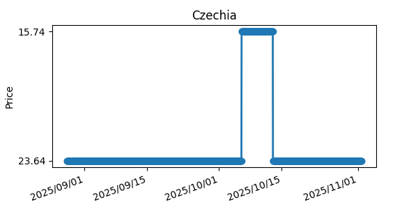
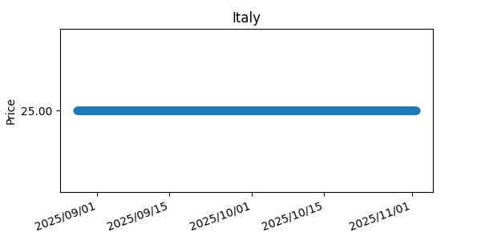
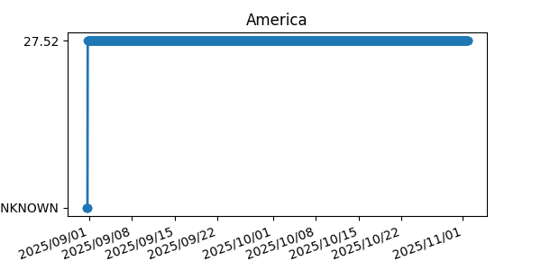

# Hey hey, we track haj prices  
Believe it or not, BLÅHAJ pricing is really not as static as it may seem!  
So like it's only logical if we tracked them, imagine overpaying for your haj collection!  
Here is all the data we collect:  
| Country | Price Local | Price Euro | Graph |  
| ------- | ------- | ------- | ------- |  
| An error occurred checking for Netherlands | _ | _ |  
Czechia:|              599,–     |(€ 23.64)|  |  
Germany:|            € 27.99     |(€ 27.99)|  |  
| An error occurred checking for Belgium | _ | _ |  
France:|             € 24.99     |(€ 24.99)|  |  
Spain:|              € 19.99     |(€ 19.99)|  |  
Poland:|               79.99     |(€ 18.35)|  |  
Italy:|              € 25.00     |(€ 25.00)|  |  
Canada:|             $ 39.99     |(€ 26.43)|  |  
| An error occurred checking for Sweden | _ | _ |  
| An error occurred checking for Denmark | _ | _ |  
Slovakia:|           € 19.99     |(€ 19.99)|  |  
Austria:|            € 24.99     |(€ 24.99)|  |  
| An error occurred checking for Switzerland | _ | _ |  
America:|            $ 29.99     |(€ 27.52)|  |  
| An error occurred checking for Japan | _ | _ |  
